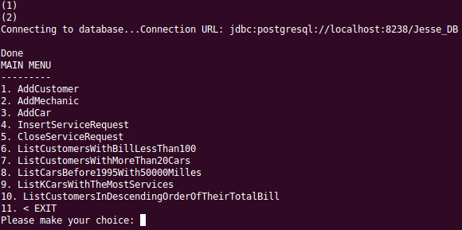

# Mechanic Shop Java Application

An application for a mechanic shop built in Java. The main focus of the application is the database backing the application. The application follows all of the constraints of the database schema. The DBMS used is PostgreSQL. I implemented an index when creating the database to drastically speed up the queries performed on the database.

To start the DB, navigate to /postgresql and run in the following order,

source startPostgreSQL.sh

source createPostgreDB.sh

Then, navigate to /java and run

./compile

./run.sh Jesse_DB 8238 jreye039

After using the application, please shut down the server by navigating back to /postgresql

Then run

source stopPostgreDB.sh
